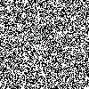
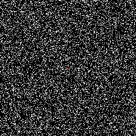

---
To whom it may concern,
This repository was made for my Physics class which i was taking at the University Of Manitoba in the winter of 2023. In this class we took a look at Computational Modeling.

There are 2 files that both simulate the groth of a crystal in a breaker full of solution that has a impurity placed in the middle. One of the python files uses Agent-Based Modelling to simulate it, while the other uses Cellular Atomaton

I hope this repository helps you in any meaningfull way. If it does, do comment! 

Please feel free to fork this code and if you can make it better, do create a pull request.
---

## Defination

An agent-based model (AVM) is a computational model that simulates the actions and interactions of autonomous agents to understand complex systems.

A cellular Automaton (CA) is a discreate model that consists of a grid of cells, each of which can be in one of a finite number of states. The states of each cell change over time according to a set of rules that depend on the states of the neighbour cells.

---

### Description of how I created the agent-based model and the cellular automaton, what the essential steps in each model were, and why I have chosen these implementations.

1. #### Steps to create a AVM for crystal growth

   - Step 1: **Defining the agents and their behaviour**
     In this case, the agents are the particles that perform Brownian motion (random walks) in continuous space. We define the behaviour of each particle by specifying the distribution of the distance it moves at each time step.

   - Step 2: **Define the environment**
     The environment is the solution in which the particles move. We define the boundaries of the environment and in this case that represents something like a breaker.

   - Step 3: **Define the rules for crystal growth**
     We need to specify when a particle sticks to the crystal. We define a threshold distance such that if a particle gets closer than this distance, to the seed or the crystal, it sticks and becomes part of the crystal. For this example, it's set to anything less or equal than 1 (in pixel)

   - Step 4: **Initialize the model**
     At the start of the simulation, we need to initialize the positions of the particles and the seed. We randomly distribute the particles within the environment and place the seed at a fixed position.

   - Step 5: **Simulate the motion of the particles**
     At each time step, we update the positions of the particles according to their behaviour (random motion).

   - Step 6: **Update the crystal**
     At each time step, you need to check if any particles have gotten close enough to stick to the crystal. If so, we update the crystal accordingly.

   - Step 7: **Repeat steps 5-6 until you reach a stopping condition**
     There can be many stopping conditions, such as a certain number of time steps have passed, or the crystal has reached a certain size. For this example, I have chosen to stop at a particular predetermined timestep.

2. #### Steps to create a CA for crystal growth

   - Step 1: **Define the grid and the states of the cells**
     A Cellular Automaton consists of a grid of cells, each of which can be in one of a finite number of states. In this case, we use a two-dimensional grid and define three states for the cells.
     _ Empty: represent by the integer value of 0
     _ Particle: represented by the integer value of 1 \* Crystal: represented by the integer value of 2

   - Step 2: **Define the rules for the evolution of the CA**
     We then need to specify how the state of each cell changes over time based on the states of its neighbouring cells. We define rules such as:
     _ a particle moves to an empty neighbouring cell in some random direction (up, down, left, right and diagonally) only if it is empty
     _ a particle becomes part of the crystal if it is adjacent to a crystal cell.

   - Step 3: **Initialize the CA**
     At the start of the simulation, you need to initialize the states of the cells. We randomly distribute particles on the grid and place the impurity at a fixed position. For this example, I have chosen to place it in the middle.

   - Step 4: **Update the CA**
     At each time step, you need to update the state of each cell according to the rules you defined in step 2.

   - Step 5: **Repeat step 4 until you reach a stopping condition**
     There can be many stopping conditions, such as a certain number of time steps have passed, or the crystal has reached a certain size. For this example, I have chosen to stop at a particular predetermined timestep.

---

### Code for the agent-based model.

The source code for the simulation of crystal growth using Agent-Based Model (ABM) can be found in the file named **ABM.py**
This code was used to generate one of the _gif_ file that you see below in section D.

---

### Code for the cellular automaton.

The source code for the simulation of crystal growth using Cellular Automaton (CA) can be found in the file named **CA.py**
This code was used to generate one of the _gif_ file that you see below in section D.

---

### Shown here at least one example for a crystal you have grown with the agent-based model and with the cellular automaton. Discussion of if and why there are any differences between the results of the two models and how the results depend on the parameters of each model.

Both Simulation was run with the same parameters, except density.

The simulation of crystal growth from an impurity in a liquid using Agent-Based Model (ABM) is shown below. In this simulation the density (i.e., the number of particles to free space in the system) is set to 75%

The simulation of crystal growth from a impurity in a liquid using Cellular Automaton (CA) is shown below. In this simulation the density is set to the other end of the spectrum, at 25%

Both models have their advantages and disadvantages. ABMs can capture more detailed behaviour and interactions between agents but can be much more computationally intensive. CAs are simpler and faster to simulate but may not capture as much detail.

The choice of which model to use would depend on one’s specific goals and requirements.

---

### JUST FOR FUN

- Tried incresing the population size to 100000. Spent hours looking at this mesmerising pattern
  

---

@author: Rubait Ul Ahamed
@contributers: Gabriel Comby (documentation)

---

Lastly, 
Major thanks and shoutout to all the contributers who take the time out to help and make open source more acessable and better for others

